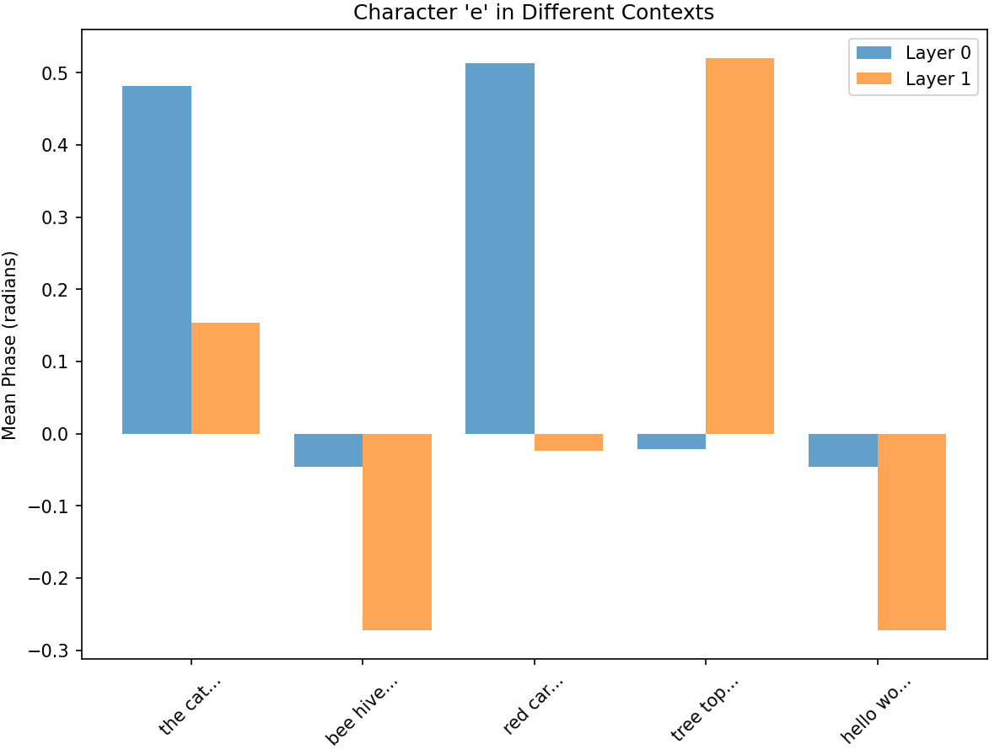

# ParadoxNet: A Transparent Language Model

> ParadoxNet is a 4-layer character-level language model whose **entire state** is inspectable.  
> It invents a **phase-based relational code** and learns stably where prior transparent nets collapse


This repository contains the code and analysis for **ParadoxNet**, a novel neural network architecture designed for inherent transparency. While most neural networks operate as "black boxes," ParadoxNet is a "white-box by design," allowing for direct observation of its internal mechanisms.

In our attempt to build a more powerful and transparent model, we found that the network learned an entirely unexpected and emergent strategy for processing language. It developed a form of contextual, relational encoding using the phase of complex numbers—a strategy that bears conceptual resemblance to the attention mechanism in Transformers, yet arises from a completely different set of principles.

## The Design Journey: From a Single Flaw to a New Architecture

Our work began with a predecessor to this model, the [Pattern Predictive Network (PPN).](https://github.com/mac-n/predictiveprocessing_nn/blob/main/ttnn_arxiv_format.pdf)The PPN is highly transparent, and excels at prediction of complex dynamics, challenging the traditional notion of a tradeoff between performance and interpretability. However the architecture had a single remaining point of opacity: the `ReLU` activation function in each layer. While simple, `ReLU` discards information (anything less than zero) in a way that is difficult to trace.

The goal for ParadoxNet was to eliminate this final piece of opacity and increase the model's power. Our development was guided by two core hypotheses:

1.  **Replacing `ReLU` with a More Transparent Non-linearity:** We replaced `ReLU` with a "Paradox" gate—a dynamic, self-referential mechanism inspired by principles of biological self-prediction. A layer's output is modulated by its own prediction error, creating a transparent, information-preserving gate.

2.  **Using Complex Space for Positional Encoding:** We projected the model's representations into the complex number domain. Our hypothesis was that this would be a natural fit for Rotary Positional Embeddings (RoPE) and would allow the network to encode positional information for text processing.

**The experiment worked, but not in the way that we expected.** The model learned to process language with remarkable stability. However, when we used its transparency to look inside, we found the mechanism it had discovered was far more elegant and surprising than the one we had expected to build.

## Architectural Components

The final architecture that emerged from this process has four key components:

1.  **Direct Character-Level Processing**: The model operates directly on character-level inputs, simplifying the design by removing the need for a complex subword tokenizer.

2.  **Complex-Valued Representations**: All hidden states are represented as complex numbers, providing a rich space where both magnitude and phase can encode information.

3.  **The "Paradox" Non-linearity**: The engine of the network. A layer's output is modulated by its own self-prediction error (`paradox = h_pred - h_linear`), allowing it to dynamically regulate information flow based on its "surprise" at the input. For a given complex hidden state $h_{\text{linear}}$, the transformation is:

$$
\text{paradox} = h{\text{pred}} - h{\text{linear}}
$$

$$
h{\text{out}} = h{\text{linear}} \cdot \sigma(\left|\text{paradox}\right|)
$$

Where:
- $h{\text{linear}}$ is the initial linear transformation of the layer's input.
- $h{\text{pred}}$ is the layer's prediction of its own state.
- $\sigma$ is the sigmoid function.
- $|\cdot|$ denotes the magnitude of the complex number.

4.  **The Consensus View**: Rather than a simple sequential pipeline, each hidden layer contributes its "opinion" to a final "Consensus View," creating a more holistic and robust signal for prediction. This is a refinement of the confidence-baed routing/surprise-based routing mechanism in the original Pattern Predictive Net.

---

## Performance on Tiny Shakespeare

ParadoxNet was evaluated against baseline architectures with similar parameter numbers on the Tiny Shakespeare dataset. The results demonstrate a critical breakthrough: **ParadoxNet learns stably on a complex language task, whereas previous transparent architectures failed catastrophically.**

| Model                   | Best Test Loss | Learning Behaviour       |
| :---------------------- | :------------- | :----------------------- |
| Standard Feed-Forward Net | 2.6578         | Catastrophic Overfitting |
| Original PPN            | 2.4077         | Catastrophic Overfitting |
| Standard Transformer    | **2.2901**     | Stable Learning          |
| ParadoxNet              | 2.5753         | Stable Learning          |

While there is still a ~12% performance gap with the Transformer, the stability of ParadoxNet confirms its viability as a foundation for a new class of models. (While it seems probable that the 4-layer ParadoxNet’s emergent phase-based “contextual tokenizer” consumes some of its limited capacity, the primary aim here is to demonstrate stable, transparent learning rather than to match Transformer perplexity.)

---

## Anatomy of a Discovery: Uncovering an Emergent Relational Engine

The true power of ParadoxNet's transparency is revealed in its analysis. Our  design for the Pattern Predictive Net includes a "Pattern Dictionary" mechanism — patterns that are learned unsupervised from a process of each layer predicting how the next layer will compress its output using attention. In a key discovery, enabled by the Paradox model's white-box design, we found that **these patterns were a vestigial component and were not used in the final model's forward pass.**

The network had learned to function without them. The real story lay in the dynamics of the paradox transformation itself:

### Key Finding 1: Representation is Contextual, Not Static

The model does not have a fixed representation for each character. Instead, the meaning of a character is defined entirely by its surroundings. Our analysis shows that the internal representation of the character 'e', for example, changes dramatically based on the characters that precede and follow it.  



This proves the network is not processing tokens in isolation. It is dynamically constructing meaning based on local context - i.e. the model appears to be effectively constructing a novel contextual tokeniser.

### Key Finding 2: The Network Speaks a Language of Phase Relationships

The network primarily encodes this contextual information not in the *magnitude* (strength) of its neurons, but in the *phase* (rotation) of its complex-valued representations. The relationship between characters is captured by the rotational difference between their phase vectors.

The model has, in an unsupervised manner, invented its own form of rotational encoding to capture the rich relationships within the data.

---

## A New Paradigm for AI Safety

We built interpretability tools so powerful, they revealed our model was doing something completely different (and more sophisticated) than we initially thought. Because ParadoxNet's internal state and rules are fully observable, we could uncover a sophisticated algorithm that would remain invisible in a black-box model. This is exactly why transparent architectures matter for AI safety:

-   **A Foundation for Scalable Oversight:** A transparent model allows for the creation of automated monitoring tools. We can build systems to watch the model's internal "language of phase," ensuring its representations remain stable and flagging any unexpected shifts in its core logic, a task impossible in opaque models.

-   **Detecting Emergent Misalignment:** This project serves as a proof-of-concept for a methodology to detect unintended emergent behaviors. The ability to identify surprising new strategies is a critical component of ensuring future, more powerful AI systems remain aligned with human values.

-   **A Pathway to Verifiable Systems:** The simplicity and mathematical precision of the Paradox Engine provide a stepping stone toward formal verification. Because the model's core rules are known, it opens the door to potentially proving that a model's behavior will remain within safe bounds.

## Future Directions

This journey has revealed two distinct and powerful mechanisms for transparent learning: the "Pattern Dictionaries" of the original PPN, which excels on chaotic sequence prediction tasks, and the "Paradox Engine" of the new model, which has shown emergent power on language.

This opens up a clear path for future research:

-   **Synthesizing Architectures:** The most compelling future direction is to investigate how these two mechanisms can be combined. A hybrid model could leverage an explicit, learned pattern dictionary while simultaneously benefiting from the fluid, emergent dynamics of the Paradox Engine.
-   **Scaling and Refinement:** Continuing to close the performance gap with opaque architectures through targeted refinements of the Paradox mechanism, and scaling to larger models. The "contextual tokeniser" behaviour discussed here emerged from a small network with only 4 layers. 
-   **Guiding Emergent Strategy:** Investigating whether the emergent phase-based learning can be guided or constrained to learn even more robust and verifiable representations.

*Code in this repository is in a state of active development. However, you can reproduce the results as follows:*


```bash
git clone https://github.com/mac-n/paradoxnet.git
cd paradoxnet
pip install -r requirements.txt
python run_complex.py
```
*The above script will train ParadoxNet for 50 epochs on 5 random seeds on TinyShakespeare and print train/test loss every epoch.  The main ParadoxNet module is paradox_net_complex.py. For more information, please contact 39732428+mac-n@users.noreply.github.com.*
