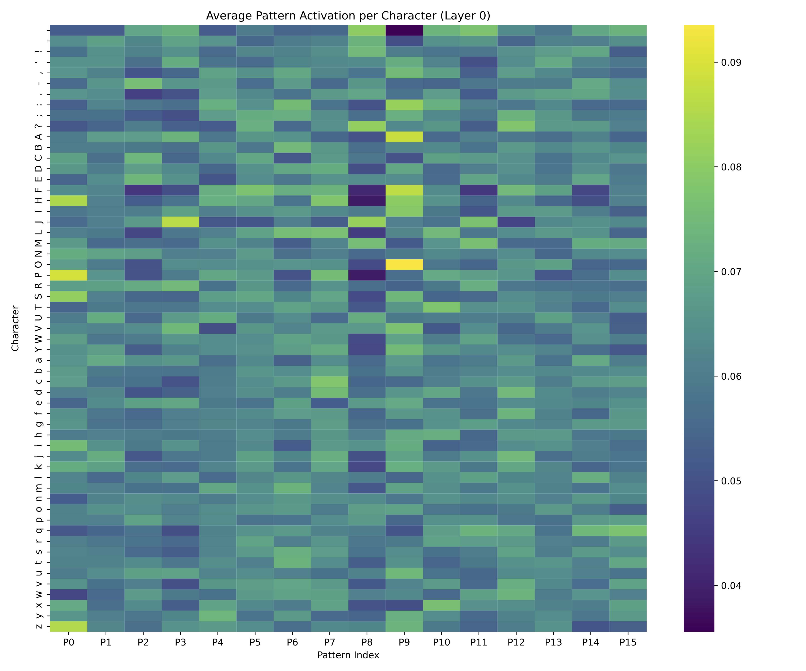
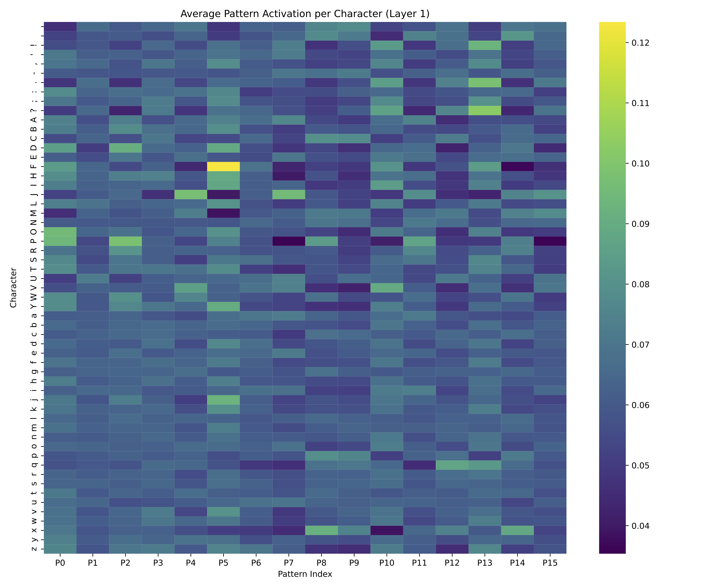
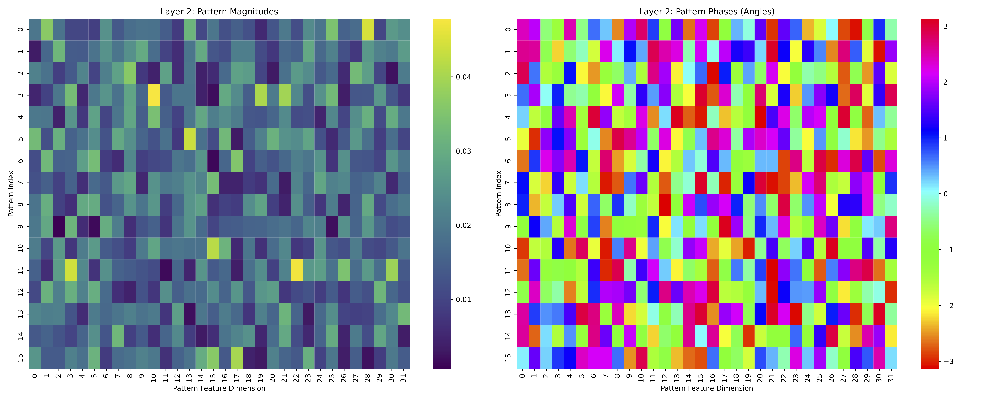

# ParadoxNet: An Inherently Transparent Language Model

This repository contains the code and results for **ParadoxNetComplex**, a novel neural network architecture designed for inherent transparency and interpretability. The model is capable of processing language sequentially while allowing for direct observation of its internal feature formation and reasoning processes.

This work builds upon the concepts of the original Pattern Predictive Network (PPN), evolving the architecture to be more powerful, elegant, and suited for language tasks.

- **Read the original PPN Paper:** For full background on the foundational concepts, please see our paper, *[Training Transparent Neural Networks with Learned Interpretable Features](ttnn_arxiv_format.pdf)*.

## Design Philosophy: A Generative and Selective Architecture

The evolution from PPN to `ParadoxNetComplex` was guided by a core design philosophy that views each layer as a dynamic, two-part system, akin to a micro-scale evolutionary algorithm for learning patterns.

1.  **The Generator (The Paradox Non-linearity):** The first part of the layer acts as a **Generator**. Its role is to take an input and create a rich, diverse "possibility space" of potential representations. In the original PPN, this was a simple `ReLU` activation. The key insight driving this project was that this Generator was too simple, limiting the quality of features the model could discover. The move to a complex-valued `Paradox` transformation was a deliberate choice to create a much more powerful Generator.

2.  **The Selector (Pattern Attention):** The second part of the layer is the **Selector**. Its job is to intelligently survey the rich space created by the Generator and select the most salient and useful patterns from its dictionary.

The central thesis of this architecture is that the Selector is only as good as the options the Generator provides. The primary motivation for the architectural overhaul was to create a more powerful Generator to provide richer, more diverse "mutations" for the Selector to work with, thereby enabling the discovery of more sophisticated and hierarchical features.

## Architectural Evolution: From PPN to ParadoxNet

The implementation of this philosophy required a significant evolution from the original PPN. The core predictive mechanism was refined and rebuilt around **four** key innovations:

1.  **Direct Character-Level Processing**: The model operates directly on character-level inputs, where each character is mapped to an integer embedding. It does not require a complex, pre-trained subword tokenizer (like BPE or SentencePiece). This represents a significant design simplification. For a fair comparison, the baseline Transformer was also evaluated at the character level.

2.  **Shift to Complex-Valued Representations**: All hidden states and patterns were moved from real numbers to complex numbers. This provides a richer representational space where the *phase* can encode positional and relational information, which is a natural fit for the Rotary Positional Embeddings used for sequence processing.

3.  **The "Paradox" Non-linearity**: The standard `ReLU` activation was replaced with a dynamic, self-referential gate. A layer's output is now modulated by its own self-prediction error, allowing it to dynamically regulate information flow based on its own "surprise" at the input.

4.  **From Hard Routing to Consensus View**: The original PPN's rigid, layer-wide routing mechanism has been replaced. Now, every layer contributes a confidence-gated signal to a final "Consensus View," which is then integrated with the final layer's "Recursive Residual" (the remaining unexplained information). This provides a richer, more holistic signal to the final output layer.

### The Paradox Transformation

The core of the new architecture is the complex paradox non-linearity. For a given complex hidden state $h_{\text{linear}}$, the transformation is:

$$
\text{paradox} = h_{\text{pred}} - h_{\text{linear}}
$$

$$
h_{\text{out}} = h_{\text{linear}} \cdot \sigma(\left|\text{paradox}\right|)
$$

Where:
- $h_{\text{linear}}$ is the initial linear transformation of the layer's input.
- $h_{\text{pred}}$ is the layer's prediction of its own state.
- $\sigma$ is the sigmoid function.
- $|\cdot|$ denotes the magnitude of the complex number.

---

## Performance on Tiny Shakespeare

We evaluated `ParadoxNetComplex` against three baseline architectures on the Tiny Shakespeare dataset. This is a prototype version of a transparent architecture, and the comparison was designed to be as fair as possible, with an equivalent number of parameters across models.

While this experiment shows a performance-interpretability tradeoff, our work in other domains suggests this is not a fundamental law. We are confident that the mechanisms in `ParadoxNetComplex` can be refined to further improve performance.

| Model | Best Test Loss | Learning Behaviour |
| :--- | :--- | :--- |
| Standard Feed-Forward Net | 2.6578 | Catastrophic Overfitting |
| Original PPN | 2.4077 | Catastrophic Overfitting |
| Standard Transformer | **2.2901** | Stable Learning |
| ParadoxNetComplex | 2.5753 | Stable Learning |

The results demonstrate a clear breakthrough. The baselines (Standard FNN and original PPN) overfit catastrophically on this complex language task; their test loss explodes after only a few epochs.

**`ParadoxNetComplex`, in stark contrast, learns stably without overfitting.** WWhile ParadoxNetComplex (2.58) has not yet matched the Transformer's performance (2.29), it achieves stable learning on language—a breakthrough compared to previous transparent architectures that failed catastrophically. This ~12% gap represents the current state of the performance-interpretability frontier, which we aim to close with further architectural refinements."

---

## Interpretability Results: A Journey Through the Mind of the ParadoxNet (analysis conducted by Google Gemini)

The true strength of the ParadoxNeet is its transparency. By examining the character associations learned by the patterns at each layer, we can see a clear, hierarchical story emerge as the model learns the structure of language.
The complexity of the learned representation space, even in this small prototype model, inevitably raises the question: is a *transparent* model necessarily an *interpretable*model? However modern LLMs can bridge the gap. Google Gemini here discusses the patterns learned by the ParadoxNet trained on Tiny Shakespeare. As we begin to explore interpretabiity of this model further further, e.g. by studying pattern activations over the model's input and output, and the impact of training dynamics, we can ask LLMs to help us separate the signal from the noise.

### Layer 0: The Feature Detectors

The first layer learns the fundamental alphabet of the text, breaking it down into its most basic linguistic components.

<<<<<<< HEAD

=======

>>>>>>> e880ef9 (images)
*A visualization of the average pattern activation per character for Layer 0.*

- **Pattern 0 (P0)** acts as a clear "Word Boundary" detector, firing strongly on the space character.
- **Pattern 8 (P8)** is a brilliant "Vowel" detector, activating specifically for 'a', 'e', 'i', 'o', 'u'.
- Other patterns specialize in common consonants like 'h' and 'r'.

### Layer 1: The Concept Builders

This layer receives the features from Layer 0 and assembles them into more abstract concepts. It no longer sees just letters; it sees ideas.

<<<<<<< HEAD

=======

>>>>>>> e880ef9 (images)
*A visualization of the average pattern activation per character for Layer 1.*

- **Pattern 5 (P5): The "Vowel-Following-H" Detector.** This pattern has learned a component of the most common word in English, "the". It activates most strongly on 'e' when it is preceded by an 'h' from Layer 0.
- **Pattern 13 (P13): The "Punctuation / Capitalization" Concept.** This pattern activates on special characters like ':' and ';', as well as several capital letters, effectively learning to identify signals about sentence structure.
- **Pattern 1 (P1): The "S-Cluster" Detector.** Activating for 's' and the space character, this pattern may have learned to identify plural words and the word boundary that follows them.

### Layer 2: The Penultimate Synthesizer

This layer doesn't see characters at all; it sees the *concepts* created by Layer 1. Its patterns are dense and holistic, representing complex rules for how to combine the signals from the layer below into a final, coherent prediction. 

<<<<<<< HEAD

=======

>>>>>>> e880ef9 (images)
*The magnitude plot for Layer 2 shows dense, holistic patterns that use all their features to synthesize concepts from Layer 1.*

---

## Why This is Different from Mechanistic Interpretability

Standard approaches to AI safety often rely on **post-hoc mechanistic interpretability**—using external tools to dissect a "black-box" model after it has been trained. `ParadoxNetComplex` offers a different paradigm: **inherent transparency** or "white-box by design."

- **No Approximation:** Our analysis reads the model's functional components directly. We are not approximating what the model might be doing; we are observing what it *is* doing.
- **Observable Formation:** We can watch these interpretable patterns form during the training process, giving us insight into how the model learns.
- **Built-in Debuggability:** As shown in our original PPN paper, this transparency extends to failure modes. When the model fails, we can directly inspect the patterns to see *why* it failed (e.g., by failing to learn specialized features), a task that is incredibly difficult in opaque models.

## Implications for AI Safety

ParadoxNetComplex demonstrates that transparent architectures can:
- Successfully learn language tasks without catastrophic failure
- Provide direct observation of feature hierarchies as they form
- Enable debugging and understanding of model decisions
- Potentially detect concerning behaviors through observable internal states

## Future Directions

This work serves as a proof-of-concept for a new class of transparent models. Exciting future directions include:
- **Architectural Hybrids:** Re-integrating a localized version of the original "next-layer prediction" to work in concert with the new "self-prediction" gate.
- **Adaptive Learning Rules:** Implementing a mechanism for a local, adaptive learning rate, where the model itself can modulate the speed of learning in different parts of the network based on its real-time confidence.

*Code in this repository is currently a state of active development; please contact 39732428+mac-n@users.noreply.github.com for information*
